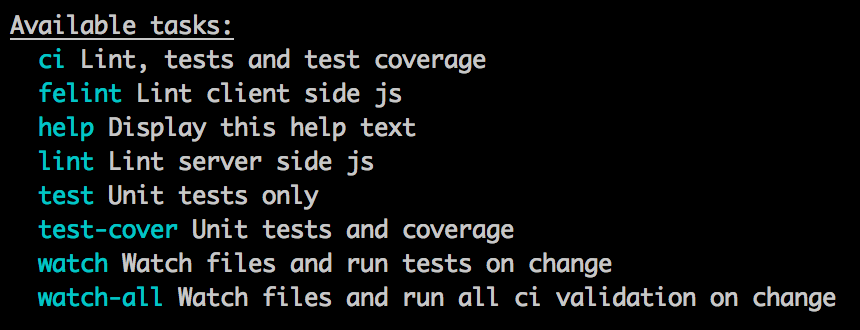

# load-common-gulp-tasks [![NPM version][npm-image]][npm-url] [![Build Status][travis-image]][travis-url]
> Load common [gulp](http://gulpjs.com/) tasks and configs so you don't need to redefine them for every module

Supplies a common interface to the following gulp modules:

1. [gulp-mocha](https://github.com/sindresorhus/gulp-mocha)
2. [gulp-jshint](https://github.com/spenceralger/gulp-jshint)
3. [gulp-istanbul](https://github.com/SBoudrias/gulp-istanbul)
4. [gulp-istanbul-enforcer](https://github.com/iainjmitchell/gulp-istanbul-enforcer)
5. [gulp-plato](https://github.com/sindresorhus/gulp-plato)
6. [gulp-help](https://github.com/chmontgomery/gulp-help)

## Available Tasks

`gulp help` for available tasks. Right now these are the default tasks:



## Basic Usage

```js
// gulpfile.js
var gulp = require('gulp');
require('load-common-gulp-tasks')(gulp);
```

## Options

`load-common-gulp-tasks` tries to assume smart defaults but also attempts to be very configurable.
Each option can be overridden by passing an `options` object as the second parameter,
e.g. `require('load-common-gulp-tasks')(gulp, options);`

### options.coverageSettings

Type: `Object`    
Default:
```js
{
  thresholds: {
    statements: 80,
    branches: 70,
    lines: 80,
    functions: 80
  },
  coverageDirectory: './target/coverage',
  rootDirectory: ''
}
```

Coverage settings for [gulp-istanbul-enforcer](https://github.com/iainjmitchell/gulp-istanbul-enforcer)

### options.paths

Type: `Object`    
Default:
```js
{
  lint: [
    './gulpfile.js',
    './lib/**/*.js',
    './test/**/*.js'
  ],
  felint: [
    './content/scripts/**/*.js'
  ],
  cover: [
    './lib/**/*.js'
  ],
  test: [
    './test/**/*.js'
  ]
}
```

Glob paths used by the associated targets

### options.jshintrc.server

Type: `String`    
Default: `./node_modules/load-common-gulp-tasks/lint/.jshintrc`

`.jshintrc` file to use when running `gulp lint` target

### options.jshintrc.client

Type: `String`    
Default: `./node_modules/load-common-gulp-tasks/felint/.jshintrc`

`.jshintrc` file to use when running `gulp felint` target

### options.complexity.destDir

Type: `String`    
Default: `./target/complexity`

Report destination.

### options.complexity.options

Type: `Object`    
Default: `{}`

[Options](https://github.com/philbooth/complexity-report#command-line-options) passed to complexity-report.

### options.showStreamSize

Type: `Boolean`   
Default: `false`

Optionally show the gulp stream size of each task

## Advanced Usage

To override default tasks or create new ones, simply define them after calling `require('load-common-gulp-tasks')(gulp);` in your `gulpfile.js`, e.g.

```js
var gulp = require('gulp'),
  sass = require('gulp-sass'),
  rename = require('gulp-rename'),
  bourbon = require('node-bourbon').includePaths,
  neat = require('node-neat').includePaths,
  libPath = 'lib',
  sassPath = libPath + '/*/sass',
  sassFiles = sassPath + '/*.scss',
  options;

// ------------------------
// custom coverage settings
// ------------------------
options = {
  coverageSettings: {
    thresholds: {
      statements: 83, // higher than default
      branches: 59, // lower than default
      // lines not defined. use default
      functions: 58
    }
  }
};

// ------------------------
// load common tasks
// ------------------------
require('load-common-gulp-tasks')(gulp, options);

// ------------------------
// custom tasks
// ------------------------
gulp.task('watch', 'Watch sass files and recompile on change', function () {
  gulp.watch([sassFiles], ['styles']);
});

gulp.task('styles', 'Compile sass to css', function () {
  return gulp.src(sassFiles)
    .pipe(sass({
      includePaths: [sassPath].concat(bourbon).concat(neat)
    }))
    .pipe(rename(function (path) {
      var moduleName = path.dirname.split('/')[0];
      path.dirname = moduleName + '/content/styles';
    }))
    .pipe(gulp.dest('./' + libPath));
});
```

[npm-url]: https://npmjs.org/package/load-common-gulp-tasks
[npm-image]: http://img.shields.io/npm/v/load-common-gulp-tasks.svg
[travis-image]: https://travis-ci.org/chmontgomery/load-common-gulp-tasks.svg?branch=master
[travis-url]: https://travis-ci.org/chmontgomery/load-common-gulp-tasks